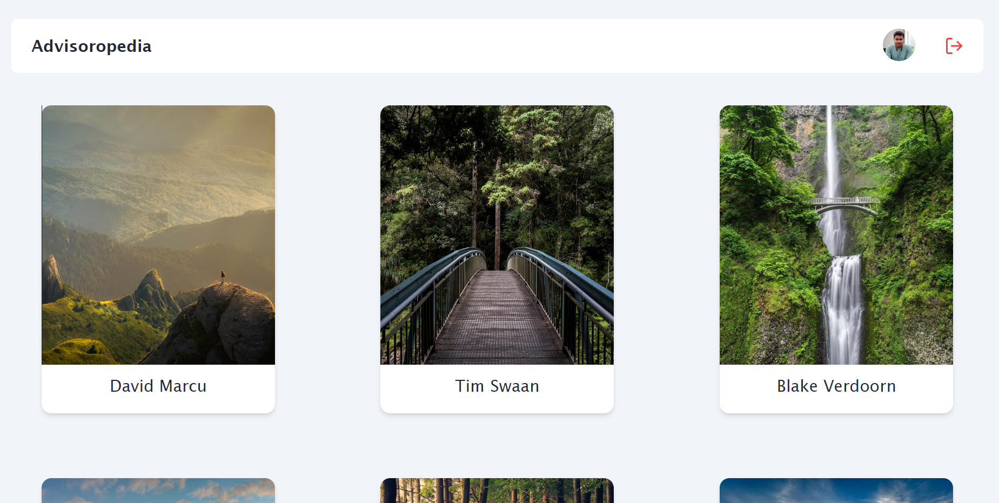

# Advisoropedia Full Stack Assignment

This comprehensive full-stack assignment is crafted using the MERN (MongoDB, Express.js, React.js, Node.js) stack, incorporating JWT Authentication. The application delivers a polished and responsive user interface, featuring infinite scrolling and lazy loading functionalities.

## Signup Screen

- Implemented fields for Name, Username, and Password with confirmation.
- Integrated validation for mandatory fields.
- Added a terms and conditions checkbox.
- Clear error messages and success messages are displayed.
- A welcome popup appears upon successful signup or login.
- Implemented React Router to redirect users to the post list screen after successful signup.

## Post List Screen

- Allows users to scroll infinitely, with posts rendered using the GET API of posts.
- Achieved a fully responsive design using Tailwind CSS.
- Implemented Logout functionality. 

## Demo Video
Demo of the assignment: [Demo video](https://drive.google.com/file/d/1LtVPG-7xjY44kshUsnwB9k8ffkS5SjjS/view?usp=sharing)  

## Technology Used

- **MongoDB**: Database for storing user data and messages.
- **Express.js**: Server-side framework for handling HTTP requests and responses.
- **React.js**: Frontend library for building the user interface.
- **Node.js**: JavaScript runtime for server-side development.
- **Tailwind CSS and DaisyUI**: Styling libraries for a clean and visually appealing UI.
- **React Hot Toast**: Notification library for displaying alerts.

## Live Preview

Explore the assignment in action: [Live Preview]()

